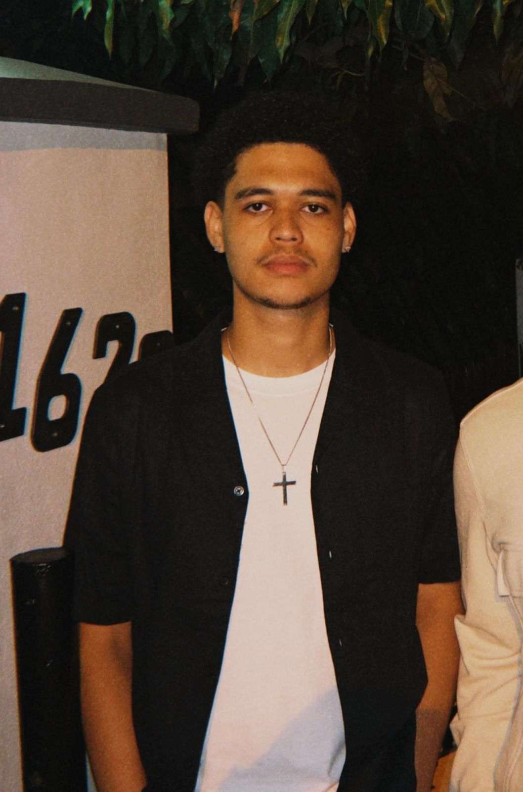
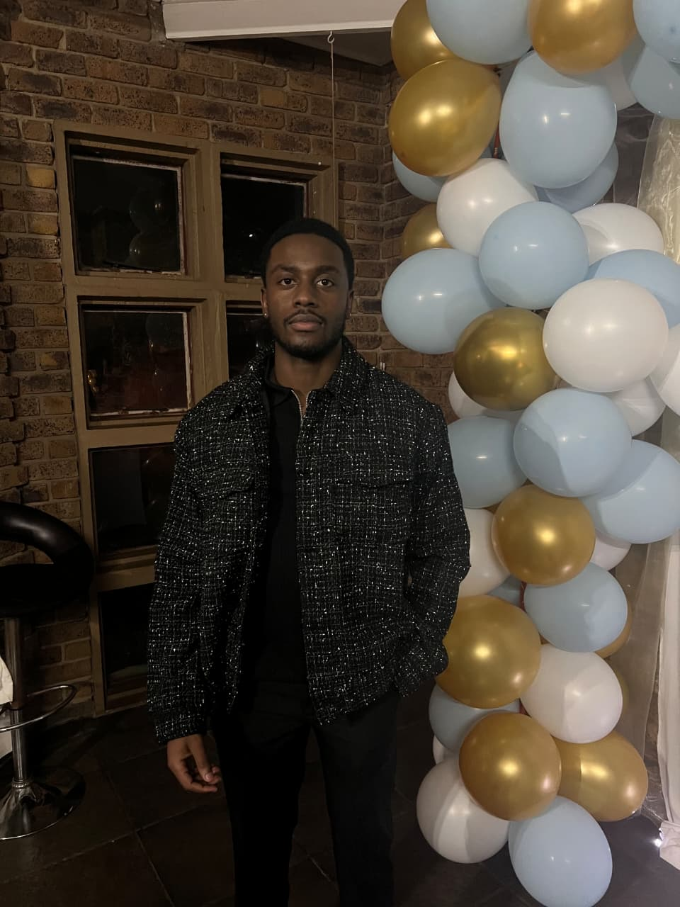

# Driving-Tracker
---

## Project Description

Driving Tracker is a COS 301 Capstone Project developed for Gendac (Software, Innovations & IoT).
It is a next-generation Android driving assistant that brings together phone sensors, Azure Maps
and OBD-II vehicle data to analyse driving behaviour, fuel efficiency, and vehicle health -
wrapped in gamification and social features to make safer driving engaging and rewarding.

**Client:** Gendac\
**Team:** OmniTech

---

## Documentation
[Software Requirement Specification](docs/SRS.pdf)\
[Github Project Board](https://github.com/orgs/COS301-SE-2026/projects/56)

---

## Meet OmniTech

| |
|:---:|
| **Brayden Butler** |
| Team Lead • Backend |
|   |

| |
|:---:|
| **Sentelweyinkhosi Mngomezulu** |
| Backend Engineer |
|   |

| |
|:---:|
| **Mosa Leiee** |
| Frontned Engineer |
|   |

| |
|:---:|
| **Kundai Ndemera** |
| Frontend Engineer |
|   |

| |
|:---:|
| **Lesedi Padi** |
| Backend Engineer |
|   |

---

## Tech Stack

- **Mobile:** Kotlin, Android Sensor API, Azure Maps, Bluetooth OBD (ELM327), Retrofit
- **Backend:** Node.js + Express, REST API, WebSockets, JWT Auth
- **Database:** PostgreSQL DB, Redis
- **Infrastructure:** Microsoft Azure App Service, Azure Functions, Azure Blob Storage
- **Web Dashboard:** React + Next.js + TypeScript, Tailwind CSS

---

## Branching Strategy

| Branch | Purpose |
|--------|---------|
| `main` | Stable, demo-ready releases only |
| `develop` | Integration branch - all PRs merge here |
| `feature/name/description` | New feature development |
| `fix/name/description` | Bug fixes |
| `docs/name/description` | Documentation updates |

---