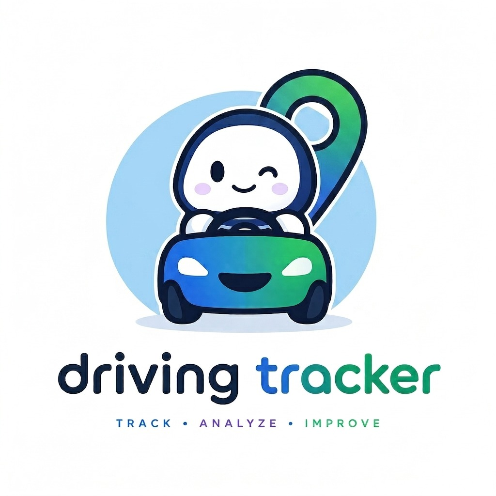
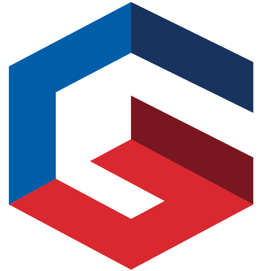

<div align= "center">
  
  
  <br/>
  
  
  

<br/>


</div>

> An intelligent Android driving companion that unifies sensor fusion, vehicle diagnostics, behavioural analytics, and social engagement into one platform - making safer, more efficient driving accessible and rewarding for everyday drivers.


[](https://codecov.io/gh/COS301-SE-2026/Driving-Tracker)


[](https://github.com/COS301-SE-2026/Driving-Tracker/pulls)


<h2>Client</h2>
</br>
 
Gendac (Software, Innovations & IoT)

---

## Table of Contents

- [Project Description](#project-description)
- [Documentation](#documentation)
- [Meet OmniTech](#meet-omnitech)
- [Tech Stack](#tech-stack)
- [Branching Strategy](#branching-strategy)
- [Getting Started](#prerequisites)
  - [Prerequisites](#prerequisites)
  - [Running](#running)


---

## Project Description

Driving Tracker is a COS 301 Capstone Project developed for Gendac (Software, Innovations & IoT). It is a next-generation Android driving assistant that brings together phone sensors, maps, and OBD-II vehicle data to analyse driving behaviour, fuel efficiency, and vehicle health - wrapped in gamification and social features to make safer driving engaging and rewarding.

The system operates across three layers:
- **Data Collection** - phone sensors, GPS, and Bluetooth OBD-II (ELM327) provide a 360° view of vehicle and driver behaviour.
- **Intelligent Analysis** - a modular Azure-hosted backend processes driving patterns, safety scores, eco-driving insights, and vehicle health in real time.
- **Engagement** - leaderboards, badges, weekly challenges, and a family safety network transform raw data into a motivating experience.

---

## Documentation
[Software Requirement Specification](docs/Documentation-Demo1/OmniTech%20SRS.pdf)\
[Wireframes](docs/Documentation-Demo1/Wireframes.pdf)\
[Brand style guide](docs/Documentation-Demo1/Brand%20Style%20Guide.pdf)\
[Github Project Board](https://github.com/orgs/COS301-SE-2026/projects/56)\
[Demo1 video](docs/Documentation-Demo1/Demo1.mp4)

---

## Meet OmniTech

| |
|:---:|
| **Brayden Butler** |
| Team Lead • Backend |
| [](https://github.com/Brayden-ux) [](https://www.linkedin.com/in/brayden-butler-b96591328?) |

| |
|:---:|
| **Sentelweyinkhosi Mngomezulu** |
| Backend Engineer |
| [](https://github.com/SenteMngomez) [](https://www.linkedin.com/in/sentelweyinkhosi-mngomezulu?) |

| |
|:---:|
| **Mosa Leiee** |
| Frontend Engineer |
| [](https://github.com/Mosa-L) [](https://www.linkedin.com/in/mosa-leiee?) |

| |
|:---:|
| **Kundai Ndemera** |
| Frontend Engineer |
| [](https://github.com/kundaindemera) [](https://www.linkedin.com/in/kundai-ndemera?) |

| |
|:---:|
| **Lesedi Padi** |
| Backend Engineer |
| [](https://github.com/Padi-le) [](https://www.linkedin.com/in/lesedi-padi-b90ba3271?) |

---

## Tech Stack

| Layer | Technologies |
|-------|-------------|
| **Mobile** | Kotlin, Android Sensor API, Mapbox, Bluetooth OBD (ELM327), Retrofit |
| **Backend** | Node.js, Express, REST API, WebSockets, JWT Auth |
| **Database** | PostgreSQL, Redis |
| **Infrastructure** | Microsoft Azure App Service, Azure Functions, Azure Blob Storage |
| **Web Dashboard** | React, Next.js, TypeScript, Tailwind CSS |

---

## Branching Strategy

| Branch | Purpose |
|--------|---------|
| `main` | Stable, prod-ready releases only |
| `develop` | Integration branch - all PRs merge here and new branches branch from here|
| `feature/name/description` | New feature development |
| `fix/name/description` | Bug fixes |
| `docs/name/description` | Documentation updates |
| `chore/name/description` | Config, tooling, setup |

---

## Getting Started (Install + Run from Scratch)

This project is composed of 3 parts:
- Backend API (Node/Express) 
- Frontend dashboard (Next.js)
- Android app (Android Studio/Gradle)

### Prerequisites

Install every tool below before continuing. Each one is required.

---

#### 1. Node.js (v20)

Node.js is the runtime that powers the backend and frontend build tools. We use version 20.

The recommended way to install Node.js is through **nvm** (Node Version Manager), which lets you install and switch between Node versions without conflicts.

``` bash
#install nvm
curl -o- https://raw.githubusercontent.com/nvm-sh/nvm/v0.39.0/install.sh | bash

#reload shell
source ~/.bashrc #bash users
OR 
source ~/.zshrc #zsh users

#Install Node 20
nvm install 20
nvm use 20

#verify
node --version #must show v20.x.x
```

#### 2. Yarn

Yarn is the package manager used for both the backend and frontend. It is enabled through **corepack**, which ships with Node.js - no separate download needed.
```
corepack enable
corepack prepare yarn@stable --activate

#verify
yarn --version
```

> If you see `command not found: corepack`, your Node.js version is too old. Re-run the nvm steps above.

#### 3. Docker Desktop

Docker runs the backend, frontend, and PostgreSQL database inside isolated containers. This means you do not need to install or configure a database manually - Docker handles everything.

Download and install Docker Desktop for your operating system:
- **macOS:** https://www.docker.com/products/docker-desktop
- **Windows:** https://www.docker.com/products/docker-desktop
- **Linux:** https://docs.docker.com/engine/install/

After installation, open Docker Desktop and wait for it to finish starting.

**Verify:**
```bash
docker --version
docker compose version    # must show v2.x or higher
```

> **Windows users:** Docker Desktop requires WSL 2 (Windows Subsystem for Linux). The installer will prompt you to enable it if needed. Follow the prompts and restart when asked.

---

#### 4. Android Studio 

Android Studio is the official IDE for building the Android app. It includes the Kotlin compiler, Android SDK, emulator and all build tools.

Download from: https://developer.android.com/studio

Run the installer and follow all default prompts. When the **SDK Components Setup** screen appears, ensure these are checked:
- Android SDK
- Android SDK Platform (API 34)
- Android Virtual Device
- Android Emulator

**Verify:**
After installation, open Android Studio. If it opens without errors and shows the welcome screen, it is installed correctly.

### Running

First Time - Build and Start
```bash
docker compose up --build
```

This will:
1. Build the backend and frontend Docker images
2. Start a PostgreSQL database and apply the schema automatically
3. Start the backend API
4. Start the frontend dashboard

Seed mock data in Docker:
```bash
docker compose run --rm seed
```

This runs the Prisma seed script inside the backend container after PostgreSQL and migrations are ready.


## Daily Development

```bash
# Start all services (no rebuild - faster for daily use)
docker compose up

# Start in background so terminal stays free
docker compose up -d

# Stop all services
docker compose down

# View live logs from all services
docker compose logs -f

# Rebuild images after pulling changes that modify dependencies or Dockerfiles
docker compose up --build

# Full reset - stops everything and wipes the database
# Use this if your database gets into a broken state
docker compose down -v
docker compose up --build

#Run prisma studio to see DB tables and data
docker compose up --build studio

#Running migrations with docker-compose
MIGRATION_NAME=example_name docker compose up --build migrate-dev

#Running integration tests through docker
docker compose run --rm api-test
